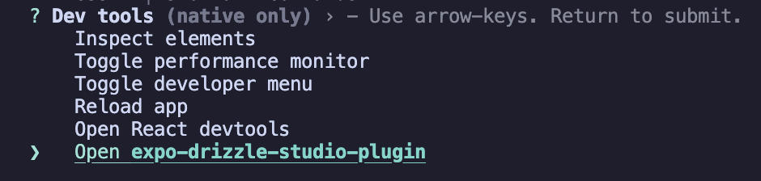
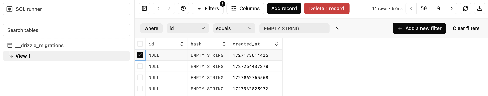
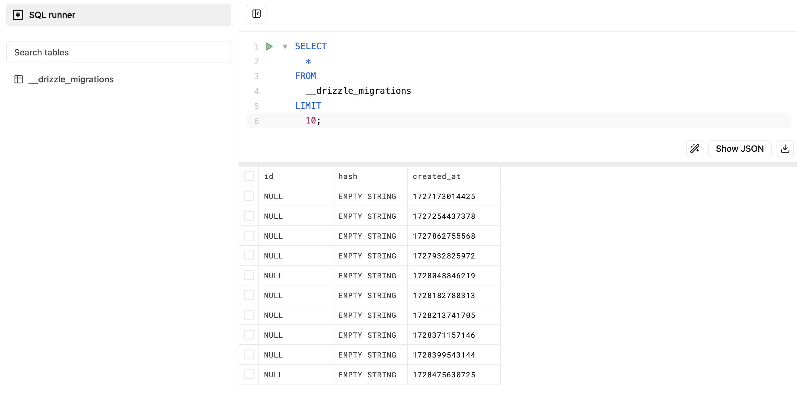

Debugging SQLite on React Native can be hard as its not a typical DB where we could connect a DB client to visualize Schema, data or run queries on top of tables. This has become easy with a tool by Drizzle called *expo-drizzle-studio-plugin* which can be used for react native SQLite even if the project is not configured to use Drizzle ORM.

First we'll setup a basic React Native project using Expo.

NOTE: There are some issues running *expo-drizzle-studio-plugin* as of this writing with latest expo SDK 52 with new architecture - [Github Issue](https://github.com/drizzle-team/drizzle-studio-expo/issues/4). 

Tested this plugin with react-native: 0.74.5, expo: 51.0.37, expo-sqlite: 14.0.6, expo-drizzle-studio-plugin: 0.0.2

```bash
npx create-expo-app@latest
```

For the SQLite I'm using expo-sqlite but other flavors of SQLite should also work. 

```bash
npx expo install expo-sqlite
```

Now to the fun part. For attaching a DB client to the React Native SQLite, install expo-drizzle-studio-plugin which is drizzle studio designed for expo react native projects.

```bash
npm install expo-drizzle-studio-plugin 
```

Then in the root of the project (app/_layout.tsx or App.ts), import expo drizzle studio along with a connection object to the SQLite database that you want to visualize. An example goes as follows

```js
import { useDrizzleStudio } from 'expo-drizzle-studio-plugin';
import * as SQLite from 'expo-sqlite';
const db = SQLite.openDatabaseSync("sample.db");

// This following table creation code is optional. Inserting a table for testing
db.execAsync(`
  CREATE TABLE IF NOT EXISTS test (id INTEGER PRIMARY KEY NOT NULL, value TEXT NOT NULL, intValue INTEGER);
  INSERT INTO test (value, intValue) VALUES ('test1', 123);
  INSERT INTO test (value, intValue) VALUES ('test2', 456);
  INSERT INTO test (value, intValue) VALUES ('test3', 789);
`).then();

export default function App() {
    useDrizzleStudio(db);

    /* REST OF THE CODE */
}
```

Generate android and ios code using CNG feature of Expo. This does not work with Expo go and requires native app compilation.

```bash
npx expo prebuild --clean

npx expo run:ios
npx expo run:android
```

After you run the app, open devtools menu ( shift + m ) from the terminal and choose *expo-drizzle-studio-plugin*



In the browser you should see the following UI. In the following view, you could see tables, data, add custom filters, modify records, export and many more.



You could also execute queries on tables using SQL runner



As of this writing, it has note worthy features like

- Executing queries using SQL runner
- Visualizing table data
- Filtering with where clauses in UI
- Add, Edit, Delete row data
- Exporting data to JSON or CSV

### References

- https://docs.expo.dev/versions/latest/sdk/sqlite/
- https://github.com/drizzle-team/drizzle-studio-expo
